# Caning Peg Lattices

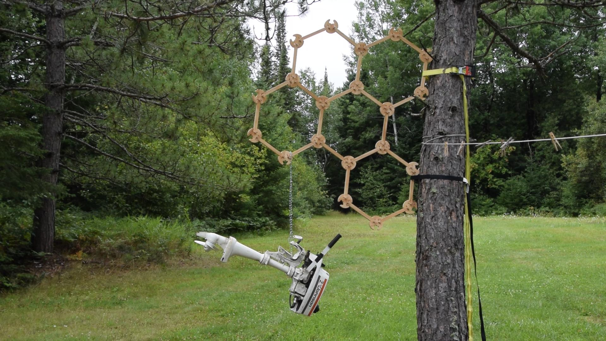
_above, a reversibly assembled caning peg lattice consisting of five hexagons is used to suspend a 2 HP outboard boat engine from a Norway pine._

Caning peg lattices are sturdy person-scale structures assembled from three parts: struts, nodes, and caning pegs. Assembly is carried out using a simple tool assembled from one of each of these parts. This tool is also used to quickly disassemble the lattice for transport, storage, or re-configuration. 

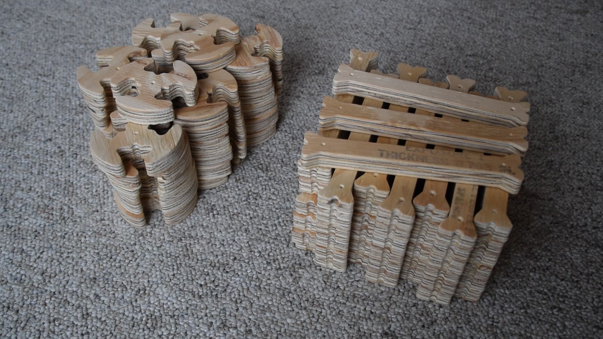
_above, a satisfying stack of struts and nodes; below, I hold up an assembled caning peg lattice._

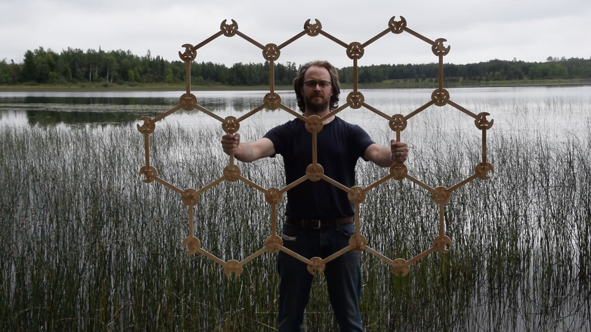

Caning peg lattices are great fun to build, particularly as a group. If you are reading this, consider finding your way to a CNC router (most models will suffice) and milling a set for yourself or your class-friends-makerspace-office-fablab-DMV. Don't forget to order caning pegs; as a rule of thumb, you'll want 350-400 pegs per full sheet of plywood you mill. At ~$0.40 each, caning peg costs easily justify sourcing nicer plywood than the leftover construction-grade stock I used for the first prototypes. Please note that I'm releasing this project under the terms of the Creative Commons Attribution-ShareAlike 4.0 International license; you can read more [here](https://creativecommons.org/licenses/by-sa/4.0/?ref=chooser-v1), but it generally means you are free to make/modify/sell derivative works provided your version is released under the same terms. And please let me know if you do build a set, so that I can link to your project!

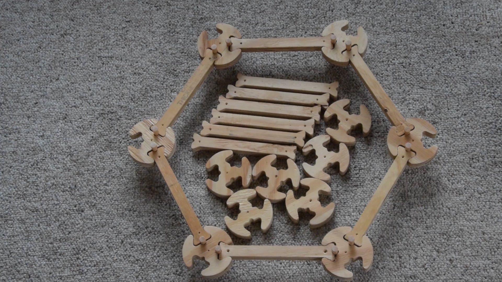
_above, an assembled hexagon with its constituent struts and nodes; below, two handfuls of caning pegs tumble to the floor._

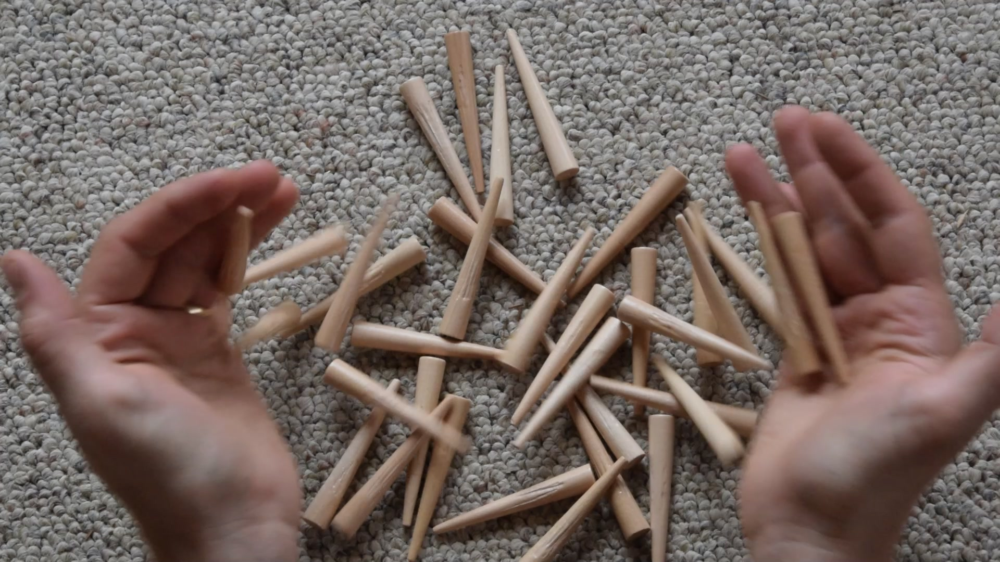

Struts and nodes are milled from plywood, while caning pegs are commercially available tapered maple rods used in chair caning. Struts are long slender straight pieces and fit into round nodes at connection points. Sliding a tapered caning peg into the resulting circular gap between the struts and nodes pins them into place. The tool is used to tap the peg home, where it is held in place by friction. Generally speaking, the joints are quite forgiving, both to machining tolerances and to peg tapping enthusiasm; if you really hammer them in the nodes can break, but I've only seen this happen twice after a good bit of rough use. 

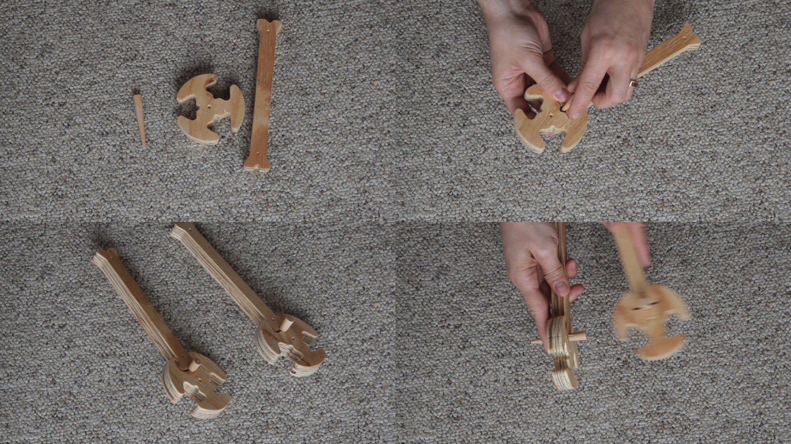
_above, clockwise from top left: the parts needed to build a lattice assembly/disassembly tool; pinning the strut and node together with a caning peg; using another tool to tap the peg home; two finished tools._

In the first iteration of caning peg lattices, nodes have three equiangular attachment points, so connecting them to neighboring nodes using struts results in a planar hexagonal lattice. Opposing pairs of nodes in the lattice measure roughly 16" (~400 mm) between centers, conveniently sized to hang on hooks installed in a US-spec stud wall. The amount of area which is covered by the parts milled from a standard 4x8 foot (~3 m^2) sheet of plywood depends on the configuration. If connected to form a larger hexagon, two such sheets of plywood should be just enough to build a 91-hexagon r=6 sheet (where e.g. Webb is r=3), resulting in a long diagonal length of 4.8 m (~16 ft), a total area of 12.6 m^2, and an expansion ratio (e.g. large hexagon area vs uncut plywood area) of ~2.6. Such a structure requires 612 caning pegs and a fairly large room to build it, roughly two parking spots side-by-side. 

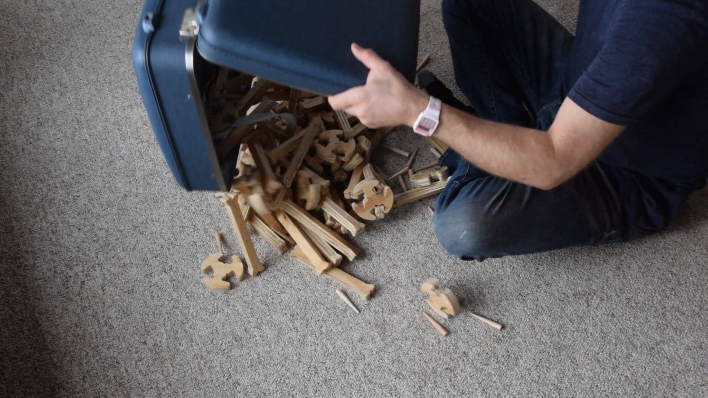
_above, a collection of struts, nodes, and caning pegs tumble from a suitcase, making a delightful noise in the process._

Caning peg lattice joints incorporate a bit of intentional compliance, both in off-plane bending and in in-plane rotation. This allows a long string of hexagons to be connected to form a large circle, or a 7-hexagon cluster to be hollowed out and connected with five rather than six neighbors, forming a slight dome. Eventually, one (of many) directions I'd like to take this project is towards the scale of the built environment; imagine macro-scale nanotube-like structures with dome lids, interconnected to form useful gathering spaces which are optionally skinned with a weatherproof shell to form temporary shelters.

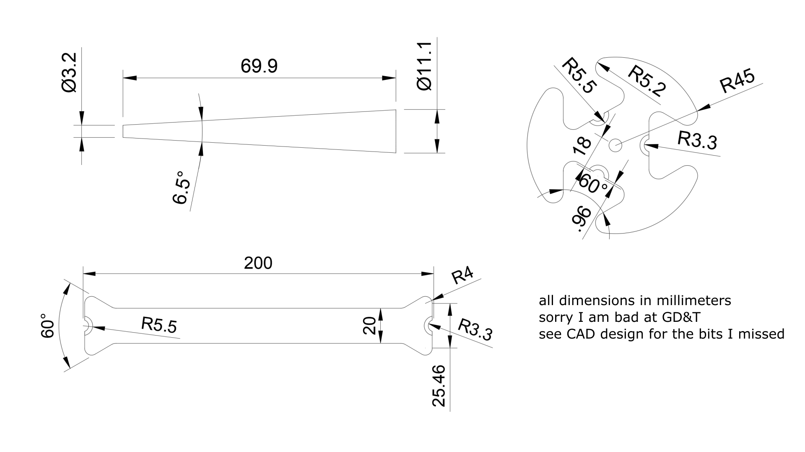
_above, dimensions of caning pegs, struts, and nodes, from the first iteration of the project._

Caning pegs grew out of an earlier exploration I undertook during [grad school](https://cba.mit.edu) into what I called _orthogonal taper pin joints_: planar connections pinned together using tapered pins inserted at a right angle to the other parts. I originally used this method at a smaller scale to build modular superelastic flexural machines, like a [3-degree-of-freedom parallel compliant manipulator](https://zachfred.in/projects/3rr-cpm/index.html) I used to rule laughably crude gratings and a [50:1 CNC pantograph](https://github.com/zakqwy/micropanto) I used to carve tiny messages on grains of rice. In addition to the links above, this project draws significant insipration from other CBA projects and students, particularly the lattice and joint design work from Ben Jenett et al. (see [here](http://cba.mit.edu/docs/papers/20.11.meta_combined.pdf) and [here](http://cba.mit.edu/docs/papers/16.07.msec.bridge.pdf), to start), while also acknowledging that this project lacks the sort of analysis, rigor, and scale to be lumped into the same category as his explorations.

Beyond the change in scale and material, caning pegs have a much greater included angle as compared to standard metal taper pins. Because of this, I tailored the machining toolpaths to leave distinct "teeth" in the struts and nodes which dig into the caning pegs, which seems to help keep them in place without causing too much harm to the wood surface. 

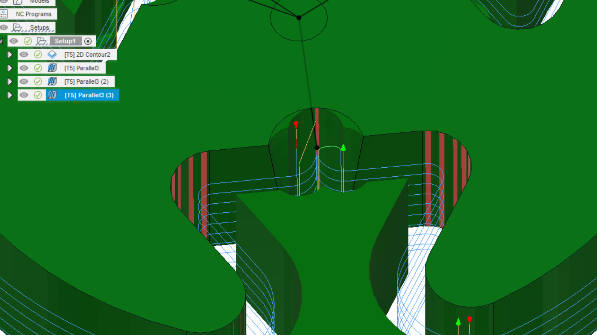
_above, a detailed look at the machining toolpath for node production, showing a 2D outline and parallel contours which leave teeth in the tapered holes; below, a few struts, nodes, and caning pegs in CAD._

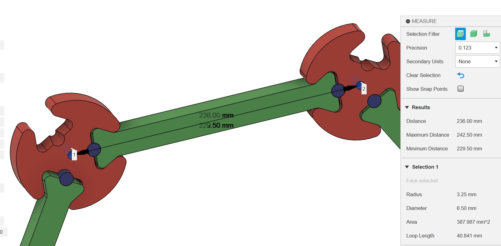

I designed the struts and nodes in Fusion 360. I'm not a fan of proprietary file formats (or CAD programs that phone home, for that matter), but it was the right tool at the time; the free version was sufficient for a simple project like this (although I was frustrated by the need to manually string together individual G-Code files to gang operations together, and it's annoying to only be able to work on a few files at once, blah blah blah...). In any case, the original *.f3d archives, along with *.step and *.stl exports, all live in the [cad](cad) directory. Note that nodes are often called "trinodes", anticipating a future where other types of nodes will hopefully exist. 

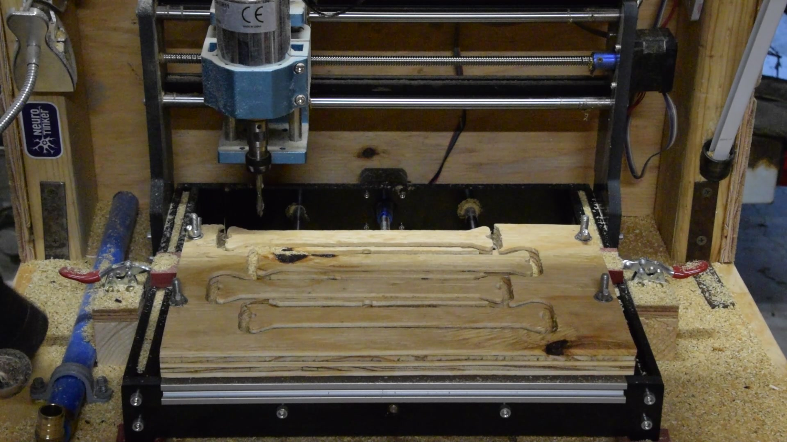
_above: machining four struts on a low-cost (but still quite capable) Sainsmart 3018-PRO router quipped with a 300 W spindle and a 1/4" combination end mill; below, 7" x 12" (~180 mm x 300 mm) offcuts from strut and node production._

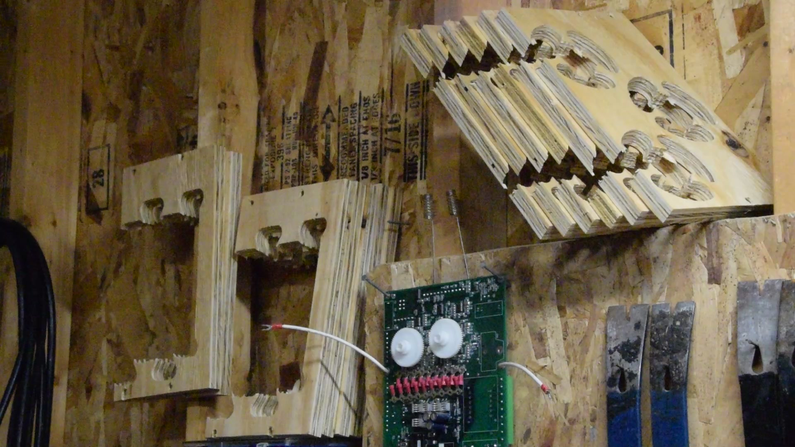

I machined all of the parts using a low-cost but incredibly capable 3018-PRO CNC router from Sainsmart, equipped with a 300 W spindle upgrade and a scrap-built enclosure. I ran the router pretty hard given its size and typical use cases; the eventual toolpaths I settled on (see [fab](fab) folder) used a 1/4" combination mill running at 2000 mm/min (~80"/min) and 2 mm depth per pass, at whatever maximum RPM the upgraded (but still fairly small) motor could manage. With these settings, a sheet of struts took around 30 minutes to complete, giving me nice time chunks to undertake much-needed garage organization projects while still listening for alarming CNC router noises. Janet included the router as a present when I bought her car to get to my cabin for the summer. Thanks Janet! 

Caning peg lattices are a rich space for exploration. I have spent the last month or so contemplating the myriad directions I'd like to take this project; to keep this write-up relatively brief, I'll just include a notebook page image which highlights some of my future plans. For now, go build caning peg lattices!

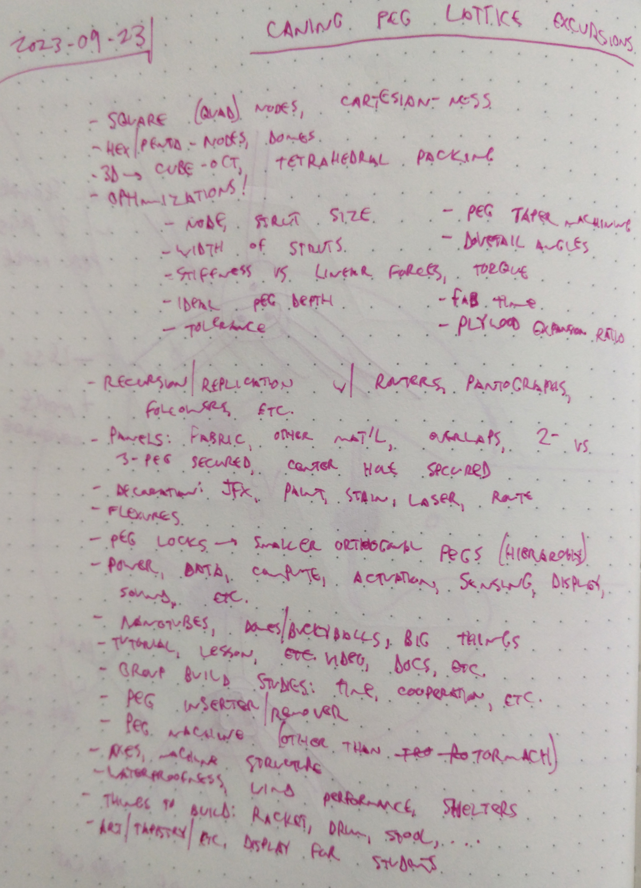

_above: future plans, hastily scribbld in my notebook._

 
<a property="dct:title" rel="cc:attributionURL" href="https://github.com/zakqwy/caning-peg-lattices">Caning Peg Lattices</a> by <a rel="cc:attributionURL dct:creator" property="cc:attributionName" href="https://zachfred.in">Zach Fredin</a> is licensed under <a href="http://creativecommons.org/licenses/by-sa/4.0/?ref=chooser-v1" target="_blank" rel="license noopener noreferrer" style="display:inline-block;">CC BY-SA 4.0</a>
 

 © copyright zach fredin, 2023